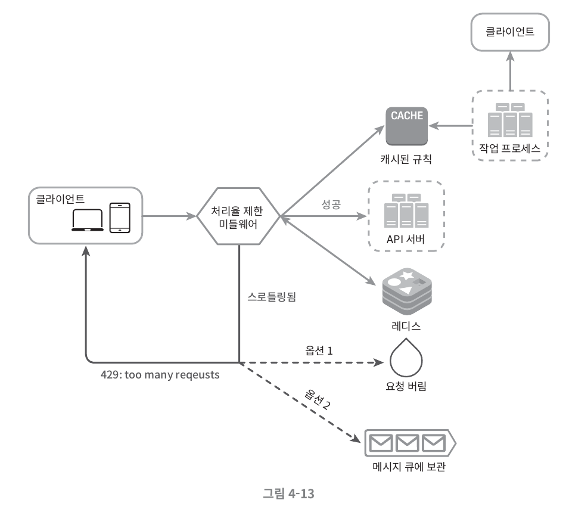
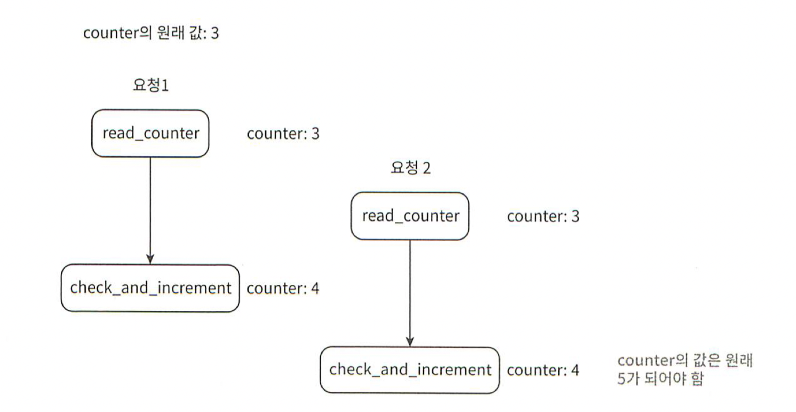

# 처리율 제한 장치의 설계

### 처리율 제한 장치 (rate limiter)
> 클라이언트 또는 서비스가 보내는 트래픽의 처리율(rate)을 제어하기 위한 장치

### 요구사항 예시
- 사용자는 초당 2회 이상 새 글을 올릴 수 없다.
- 같은 IP 주소로는 하루에 10개 이상의 계정을 생성할 수 없다.
- 같은 디바이스로는 주당 5회 이상 리워드를 요청할 수 없다.

### 장점
- Dos(Denial of Service) 공격에 의한 자원 고갈 방지
- 추가 요청에 대한 처리를 제한하기 때문에 비용에 대한 절감 (ex - third party API 사용)
- 봇(bot) 또는 사용자의 비정상적인 이용 패턴에서 발생한 트래픽을 걸러내어 서버 과부하 예방

## 1단계 - 문제 이해 및 설계 범위 확정

### 요구사항 정리 전 질문 목록
- 어떤 종류의 처리율 제한 장치를 설계해야 하나요? 클라이언트 측 제한 장치? 서버 측 제한 장치?
- 어떤 기준을 사용해서 API 호출을 제어해야 할까요? IP 주소? 사용자 ID? 특정 기준이 있는지?
- 시스템 규모는 어느 정도여야 할까요? 스타트업 규모? 사용자가 많은 큰 기업?
- 시스템이 분산 환경에서 동작해야 하나요?
- 해당 처리율 제한 장치는 독립된 서비스입니까 아니면 애플리케이션 코드에 포함될 수도 있나요?
- 사용자의 요청이 제한된다면 이를 사용자에게 알려야 하나요?

### 요구사항
위의 질문들을 통해 시스템 요구사항을 확정할 수 있음

- 처리율을 초과하는 요청은 정확하게 제한
- 낮은 응답시간
- 최소한의 메모리
- 분산형 처리율 제한
- 예외 처리: 제한된 요청은 사용자에게 안내
- 높은 결함 감내성: 장애가 발생하더라도 전체 시스템에 영향 X (즉, SPOF X)

## 2단계 - 개략적 설계안 제시 및 동의 구하기 

### 처리율 제한 장치는 어디에 둘 것인가?
클라이언트 요청은 쉽게 위변조가 가능해 안정적으로 걸 수 있는 장소가 못 된다. 서버 또는 미들웨어가 적합하다. (API 게이트웨이도 OK)

### 처리율 제한 알고리즘

- 토큰 버킷 (token bucket)
- 누출 버킷 (leaky bucket)
- 고정 윈도 카운터 (fixed window counter)
- 이동 윈도 로그 (sliding window log)
- 이동 윈도 카운터 (sliding window counter)

## 3단계 - 상세 설계

- 처리율 제한 규칙은 디스크에 보관한다. 작업 프로세스는 수시로 규칙을 디스크에서 읽어 캐시에 저장한다.
- 클라이언트가 요청을 서버에 보내면 요청은 먼저 처리율 제한 미들웨어에 도달한다.
- 처리율 제한 미들웨어는 제한 규칙을 캐시에서 가져온다. 아울러 카운터 및 마지막 요청의 타임스탬프를 레디스 캐시에서 가져온다. 가져온 값들에 근거하여 해당 미들웨어는 다음과 같은 결정을 내린다.
  - 해당 요청이 처리율 제한에 걸리지 않은 경우에는 API 서버로 보낸다.
  - 해당 요청이 처리율 제한에 걸렸다면 429 too many requests 에러를 클라이언트에 보낸다. 해당 요청은 그대로 버릴 수도 있고 메시지 큐에 보관할 수도 있다.
  
### 분산 환경에서의 처리율 제한 장치의 구현

분산 환경에서 구현하게 된다면 다음 두 가지 과제를 해결해야 한다.

- 경쟁 조건 (race condition)
- 동기화 synchronization)

### 경쟁 조건

- 레디스에서 카운터의 값을 읽기
- counter +1의 값이 임계치를 넘는지 확인
- 넘지 않는다면 레디스에 보관된 카운터 값을 1만큼 증가

병행성이 심한 경우에는 위 이미지처럼 경쟁 조건이 발생할 수 있다. 경쟁 조건 문제를 해결하는 가장 흔한 해결책은 락이지만,
여기에 락을 건다면 시스템의 성능을 떨어뜨린다는 문제가 있다.

락 대신 쓸 수 있는 해결책
- 루아 스크립트(Lua script)
- 레디스 자료구조의 정렬집합(sorted set)

### 동기화

웹 계층은 무상태이므로 클라이언트는 다음 요청을 오른쪽 그림처럼 각기 다른 제한 창지로 보내게 될 수 있다. 이때 동기화를 하지 않는다면 제한 장치1은 클라이언트 2에 대해서는 아무것도 모르므로 처리율 제한을 올바르게 수행할 수 없을 것이다.

하지만 이 방법은 규모면에서 확장 가능하지도 않고 유연하지 않기 때문에 추천하지는 않는다. 더 나은 해결책은 레디스와 같은 중앙 집중형 데이터 저장소를 쓰는 것이다.

## 4단계 - 마무리

이번 장에서는 처리율 제한을 구현하는 여러 알고리즘과 그 장단점을 살펴보았다. 알고리즘 이외에도 아키텍처, 분산 환경에서의 처리율 제한 장치 등을 주제로 살펴보았다.

시간이 허락한다면 아래와 같은 부분을 언급해보면 도움이 될 것이다.

- 경성(hard) 또는 연성(soft) 처리율 제한
- 다양한 계층에서의 처리율 제한
- 처리율 제한을 회피하는 방법. 클라이언트를 어떻게 설계하는 것이 최선인가?