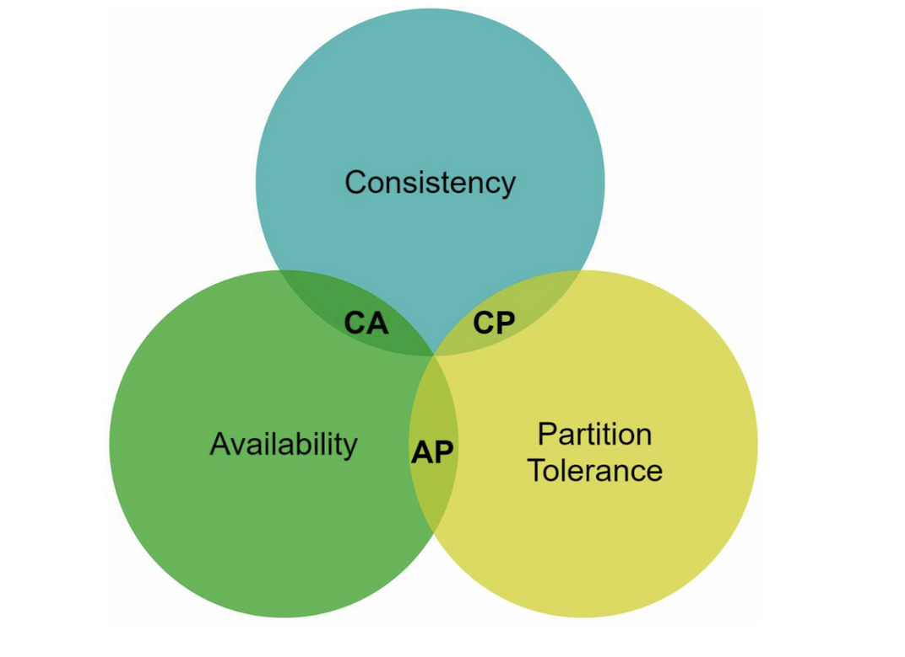
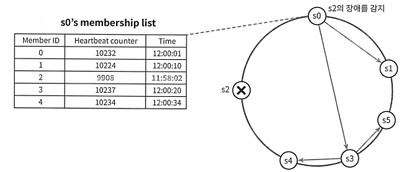
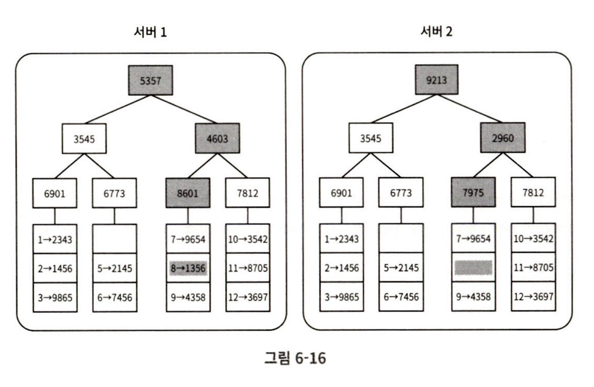
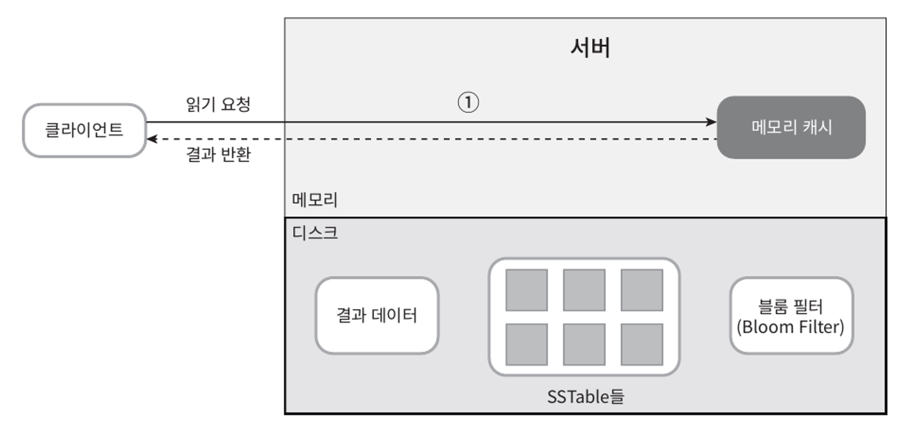
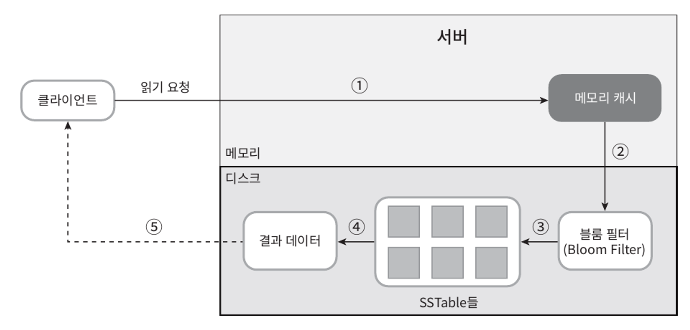

# 키-값 저장소 설계

### 키-값 저장소(key-value store)란?
- 키-값 데이터베이스라고도 불리는 비 관계형 데이터베이스이다.
- 고유 식별자를 키로 가져야 하며, 키와 값 사이의 연결 관계를 "키-값" 쌍(pair) 이라고 지칭한다.
- 키는 일반 텍스트일 수도 있고 해시 값일 수도 있다. 성능상의 이유로, 키는 짧을수록 좋다.
- 값은 문자열일 수도 있고 리스트일 수도 있고 객체일 수도 있다. 보통 값으로 무엇이 오든 상관하지 않는다.
- 키-값 저장소로 널리 알려진 것으로 아마존 다이나모, memcached, 레디스 등이 있다.

## 문제 이해 및 설계 범위 확정
- 키-값 쌍의 크기는 10KB 이하
- 큰 데이터 저장 가능
- 높은 가용성 제공 -> 장애 시에도 빠르게 응답
- 높은 규모 확장성 제공 -> 트래픽 양에 따라 자동적으로 서버 증설 및 삭제 가능
- 데이터 일관성 수준 조절 가능
- 응답 지연시간(latency) 최소

## 단일 서버 키-값 저장소
가장 직관적인 방법은 키-값 쌍 전부를 메모리에 해시 테이블로 저장하는 것이다. 
그러나 이 접근법은 빠른 속도를 보장하긴 하지만 모든 데이터를 메모리 안에 두는 것이 불가능할 수도 있다는 약적음 갖고 있다.

데이터 압축이나 자주 쓰이는 데이터만 메모리에 두고 나머지는 디스크에 저장하는 방법으로 개선할 수 있지만
많은 데이터를 저장하려면 분산 키-값 저장소를 만들 필요가 있다.

## 분산 키-값 저장소
분산 키-값 저장소는 분산 해시 테이블이라고도 한다. 키-값 쌍을 여러 서버에 분산시키는 탓이다. 이를 설계할 때는 CAP 정리를 이해해야 한다.

### CAP 정리
- 데이터 일관성(Consistency): 어느 노드에 접속하더라도 일관된 데이터(같은 데이터)를 제공
- 데이터 가용성(Availability): 일부 노드에 장애가 발생하더라도 항상 응답 제공
- 파티션 감내(Partition Tolerance): 노드간 네트워크 파티션(통신 장애)이 있더라도 시스템은 동작

**CAP 정리는 이들 가운데 어떤 두 가지를 충족하려면 나머지 하나는 반드시 희생되어야 한다는 것을 의미한다.**



- CP 시스템: 일관성과 파티션 감내를 지원. 즉, 가용성을 희생
- AP 시스템: 가용성과 파티션 감내를 지원. 즉, 데이터 일관성을 희생
- CA 시스템
  - 일관성과 가용성을 지원. 즉, 파티션 감내는 희생
  - 네트워크 장애는 피할 수 없는 일로 여겨지므로, 분산시스템은 반드시 파티션 문제를 감내할 수 있도록 설계되어야 함
  - 그러므로 실세계에 CA 시스템은 존재하지 않음

### 시스템 컴포넌트
키-값 저장소 구현에 사용될 핵심 컴포넌트 및 기술들
- 데이터 파티션
- 데이터 다중화(replication)
- 일관성(consistency)
- 일관성 불일치 해소(inconsistency resolution)
- 장애 처리
- 시스템 아키텍처 다이어그램
- 쓰기 경로(write path)
- 읽기 경로(read path)

### 데이터 파티션
데이터 파티션은 데이터를 작은 파티션들로 분할한 다음 여러 대 서버에 저장하는 것이다. 데이터를 파티션 단위로 나눌때 고려해야할 요소는 무엇일까?
- 데이터를 여러 서버에 고르게 분산할 수 있는가
- 노드를 추가 하거나 삭제할 때 데이터의 이동을 최소화할 수 있는가
 
> 5장에서 다룬 안정 해시는 이런 문제를 푸는 적합한 기술

### 데이터 다중화(replication)
높은 가용성을 위해 데이터를 N개 서버에 비동기적으로 다중화하여 저장한다. 키를 해시 링 위에 배치하고 시계 방향으로 링을 순회하여 만나는 첫 N개 서버에 데이터 사본을 보관한다.

> 해시 링 참고

### 일관성(consistency)
다중화된 노드의 데이터를 동기화를 위해 정족수 합의(Quorum Consensus) 프로토콜을 사용한다. 이 프로토콜은 3가지 값이 필요하다.

N : 사본 개수
W : 쓰기 연산에 대한 정족수. W개 이상의 서버로부터 쓰기가 성공했다는 응답을 받아야 함
R : 읽기 연산에 대한 정족수. R개 이상의 서버로부터 읽기가 성공했다는 응답을 받아야 함

```
W=N, R=1 : 읽기 연산에 최적화
W=1, R=N : 쓰기 연산에 최적화
W+R > N : 강한 일관성이 보장됨, 최소 하나의 서버는 최신 데이터를 보장
```

[ 일관성 모델 ]

일관성 수준의 정도는 다음과 같다.

- 강한 일관성(strong consistency): 모든 읽기는 가장 최근에 갱신된 결과를 반환한다.
- 약한 일관성(weak consistency): 모든 읽기가 가장 최근에 갱신된 결과를 반환하지 못 할 수도 있다.
- 최종 일관성(eventual consistency)
  - 약한 일관성 중 하나의 형태다
  - 갱신 결과가 결국에는 모든 사본에 동기화(반영)된다.

### 일관성 불일치 해소(inconsistency resolution)
#### 데이터 버저닝
#### 벡터 시계

### 장애 처리 및 감지

#### 장애를 감지하는 방법

- 멀티캐스팅(multicasting)
  - 모든 노드 사이에 멀티캐스팅 채널을 구축하는 것이 서버 가장 손쉬운 방법 
  - 서버가 많아질수록 비효율

- 가십 프로토콜(gossip protocol)
  - 각 노드는 멤버십 목록(membership list)을 유지
  - 멤버십 목록은 각 멤버 ID와 해당 멤버의 박동 카운터(heartbeat counter)로 구성
  - 각 노드는 주기적으로 자신의 박동 카운터를 증가
  - 각 노드는 무작위로 선정된 노드들에게 주기적으로 자기 박동 카운터 목록을 보냄
  - 박동 카운터 목을 받은 노드는 멤버십 목록을 최신으로 갱신
  - 어떤 멤버의 박동 카운터 값이 지정된 시간 동안 갱신되지 않을 경우, 해당 멤버를 장애 상태로 간주
  


#### 일시적 장애 처리
장애 서버 복구까지 다른 서버가 처리하고, 복구 완료 시 남겨둔 힌트로 일괄 반영하는 것을 단서 후 임시 위탁 (hinted handoff) 이라고 함

#### 영구적 장애 처리
- 반-엔트로피 프로토콜 (anti-entropy protocol)
- 머클 트리 (해시 트리)


### 쓰기 경로(write path)

(해당 예시는 카산드라의 사례를 참고한 것)

1. 제일 먼저 쓰기 요청이 커밋 로그 파일에 기록
2. 데이터가 메모리 캐시에 기록
3. 메모리 캐시가 가득차거나 사전에 정의된 어떤 임계치에 도달하면 데이터는 SSTable(디스크)에 기록

### 읽기 경로(read path)


1. 데이터가 메모리에 있는지 검사
2. 데이터가 메모리에 없으므로 블룸 필터를 검사
3. **블룸 필터**를 통해 어떤 SSTable에 키가 보관되어 있는지 알아낸다.
4. SSTable에서 데이터를 가져온다.
5. 해당 데이터를 클라이언트에게 반환

> 블룸 필터: 특정 원소가 집합에 속하는지 검사하는데 사용할 수 있는 확률형 자료 구조
