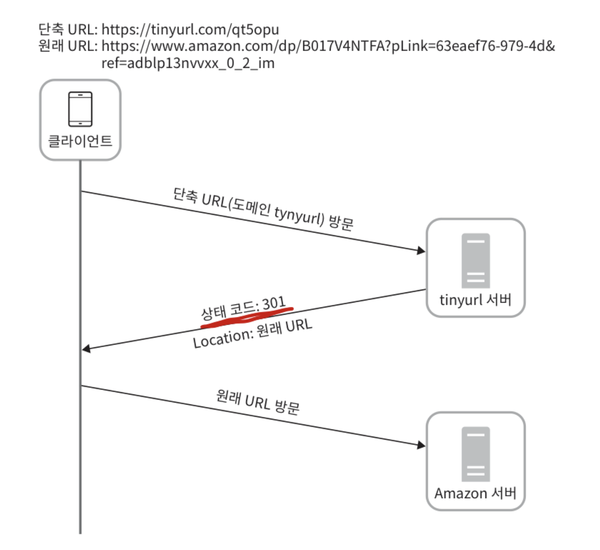
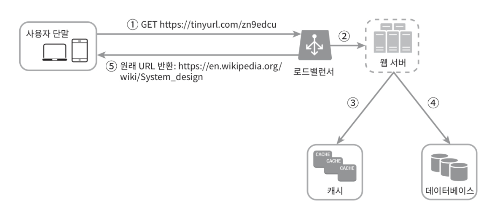

# URL 단축기 설계

## 1단계 - 문제 이해 및 설계 범위 확정

### 개략적 추정
- 쓰기 연산: 매일 1억 개의 단축 URL 생성
- 초당 쓰기 연산: 1억 / 24 / 3600 = 1160개
- 읽기 연산: 읽기 연산과 쓰기 연산 비율은 10:1 이라고 가정 -> 읽기 연산은 초당 11,600회 발생
- URL 단축 서비스를 10년간 운영한다고 가정 -> 1억 x 365 x 10 = 3650억 개의 레코드 보관
- 축약 전 URL의 평균 길이는 100 이라고 가정 -> 10년 동안 필요한 저장 용량은 3650억 x 100바이트 = 36.5TB 

## 2단계 - 개략적 설계안 제시 및 동의 구하기

### API 엔드포인트

1. URL 단축용 엔드포인트: 새 단축 URL 생성, 단축할 URL을 인자로 실어서 POST 요청을 보냄
   - POST /api/v1/data/shorten
   - 인자: {longUrl: longUrlString}
   - 반환: 단축 URL

2. URL 리디렉션용 엔드포인트: 단축 URL에 대해서 HTTP 요청이 오면 원래 URL 을 반환
   - GET /api/v1/shortUrl
   - 반환: HTTP 리디렉션 목적지가 될 원래 URL

### URL 리디렉션

단축 URL을 받은 서버는 그 URL을 원래 URL로 바꾸어서 301 응답의 Location 헤더에 넣어 반환한다.

- **301 Permanently Moved**: 이 응답은 '영구적으로' Location 헤더에 반환된 URL로 이전되었다는 응답으로, 영구적으로 이전되었으므로, 브라우저는 이 응답을 캐시한다.
- **302 Found**: 이 응답은 주어진 URL로의 요청이 '일시적으로' Location 헤더가 지정하는 URL에 의해 처리되어야 한다는 응답으로, 따로 캐시하지는 않는다.

서버 부하를 줄이는 것이 중요하다면 301을 사용하는 것이 좋으며, 트래픽 분석이 중요할 때는 302 응답을 쓰는 쪽이 클릭 발생률이나 발생 위치를 추적하는 게 좀 거 유리할 것이다.

### URL 단축
중요한 것은 긴 URL을 해시 값으로 대응시킬 해시 함수 fx를 찾는 일이 될 것이다. 해시 함수는 아래의 요구 사항을 만족해야 한다.

- 입력으로 주어지는 긴 URL이 다른 값이면 해시 값도 달라야 한다.
- 계산된 해시 값은 원래 입력으로 주어졌던 긴 URL로 복원될 수 있어야 한다.

## 3단계 - 상세 설계

### 데이터 모델
해시 테이블에 저장을 해도 문제는 없겠지만 이 접근법은 초기 전략으로는 괜찮지만 실제 시스템에 쓰기에는 곤란하다.
메모리는 유한한 데다 비싸기 때문이다. 더 나은 방법은 이 순서쌍을 (단축 URL, 원본 URL) 관계형 데이터베이스에 저장하는 것이다.

> 왜 관계형 데이터베이스를 추천하는 것일까..?

### 해시 함수

- 해시 후 충돌 해소
CRC32, MD5, SHA-1 같이 잘 알려진 해시 함수를 이용하는 것이다. 기준 길이보다 해시 값이 길다면 기준 길이만큼 잘라서 사용하면 되는데 이때 중복(충돌)이 발생할 수 있다. 
충돌이 발생했을 때는, 충돌이 해소될 때까지 사전에 정한 문자열을 해시값에 덧붙인다. 이 방법을 쓰면 충돌은 해소할 수 있지만 단축 URL을 생성할 때 한 번 이상 데이터베이스 질의를 해야 하므로 오버헤드가 크다.

> 데이터베이스 대신 **블룸 필터**를 사용하면 성능을 높일 수 있다. 블룸 필터는 어떤 집합에 특정 원소가 있는지 검사할 수 있도록 하는,
> 확률론에 기초한 공간 효율이 좋은 기술이다.
 
- base-62 변환
진법 변환은 URL 단축기를 구현할 때 흔히 사용되는 접근 법 중 하나다. 
62진법을 쓰는 이유는 해시값에 사용할 수 있는 문자 개수가 62개이기 때문이다. (즉, 62진법은 수를 표현하기 위해 총 62개의 문자를 사용하는 진법이다.)

### URL 단축기 상세 설계

[ 62진법 변환 기법을 사용한 설계 ]

1. 입력으로 긴 URL 을 받는다.
2. 데이터베이스에 해당 URL이 있는지 검사한다.
3. 데이터베이스에 있다면 해당 URL에 대한 단축 URL을 만든 적이 있으므로 DB에서 가져와서 반환한다.
4. 데이터베이스에 없는 경우에는 해당 URL에 대한 유일한 ID를 생성한다. 이 ID는 DB의 기본 키로 사용된다.
5. 62진법 변환을 적용, ID를 단축 URL로 만든다.
6. ID, 단축 URL, 원래 URL 로 새 데이터베이스 레코드를 만든 후 단축 URL을 반환한다.

