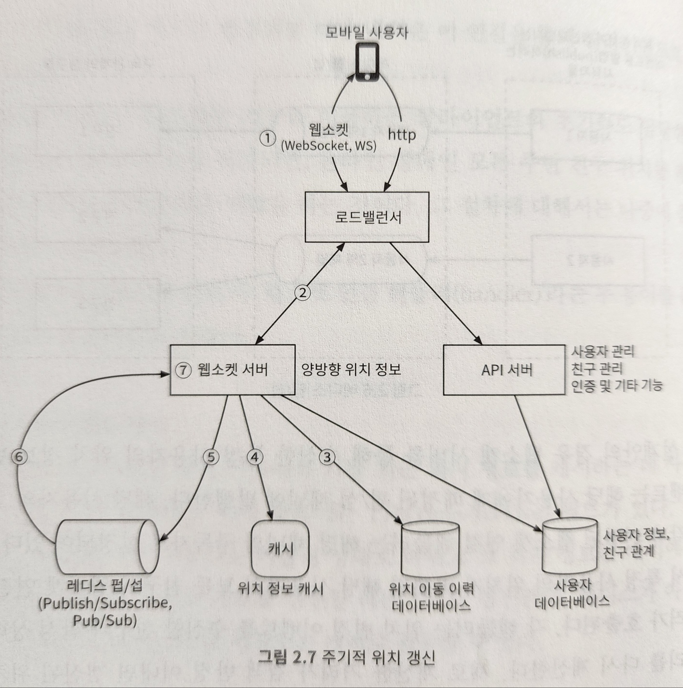

# 2장 주변친구

1장의 근접성 서비스와 비슷해보이지만 다른 점은 근접성 서비스의 사업장 위치는 정적이나, 주변 친구의 위치는 동적으로 변한다는 점이다.

### 기능 요구사항

- 사용자는 모바일 앱에서 주변 친구를 확인할 수 있어야 한다.
- 주변 친구 목록에는 친구와의 거리, 해당 경로가 마지막으로 갱신된 시간이 함께 표시되어야 한다.
- 친구 목록은 몇 초마다 한 번씩 갱신되어야 한다.

### 비기능 요구사항

- 낮은 지연 시간(low latency): 주변 친구의 위치 변화가 반영되는 데 너무 오랜 시간이 걸리지 않아야 한다.
- 안전성: 시스템은 전반적으로 안정적이어야 하지만, 때로 몇 개 데이터가 유실되는 것 정도는 용인할 수 있다.
- 결과적 일관성(eventual consistency): 사용자가 주변 친구 목록을 확인할 때, 최신 정보가 아니더라도 괜찮다.

  
### 주기적 위치 갱신

1. 모바일 클라이언트가 위치가 변경된 사실을 로드밸런서에 전송한다.
2. 로드밸런서는 위치 변경 정보를 해당 클라이언트와 웹소켓 서버 사이에 설정된 연결을 통해 웹소켓 서버로 보낸다.
3. 웹소켓 서버는 해당 이벤트를 위치 이동 이력 데이터베이스에 저장한다.
4. 웹소켓 서버는 새 위치를 위치 정보 캐시에 저장하고 TTL도 새롭게 갱신한다. 웹 소켓 서버는 웹소켓 연결 핸들러 안의 변수에 해당 위치를 반영하고, 이 값은 뒤이은 거리 계산 과정에 이용된다.
5. 웹소켓 서버는 레디스 pub/sub 서버의 해당 사용자 채널에 새 위치를 발행한다. 3번에서 5번의 단계는 병렬 처리한다.
6. 레디스 pub/sub 채널에 발행된 새로운 위치 변경 이벤트는 모든 구독자(웹소켓 이벤트 핸들러)에게 브로드캐스트된다. 각 구독자의 웹소켓 연결 핸들러는 친구의 위치 변경 이벤트를 수신하게 된다.
7. 이벤트를 받는 웹소켓 연결 핸들러가 위치한 웹소켓 서버는 새 위치를 보낸 사용자와 메시지를 받은 사용자(웹소켓 연결 핸들러 내의 변수에 그 위치가 보관) 사이 거리를 새로 계산한다.
8. 계산한 거리가 검색 반경을 넘지 않는다면, 새 위치 및 해당 위치로의 이동이 발생한 시각을 나타내는 타임스탬프를 해당 구독자의 클라이언트 앱으로 전송한다. 검색 반경을 넘는 경우에는 보내지 않는다.