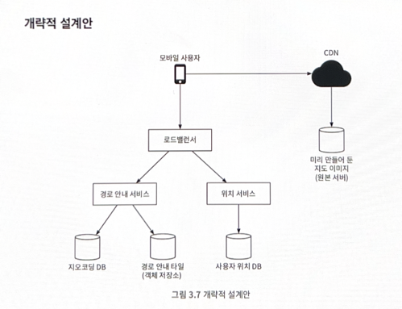
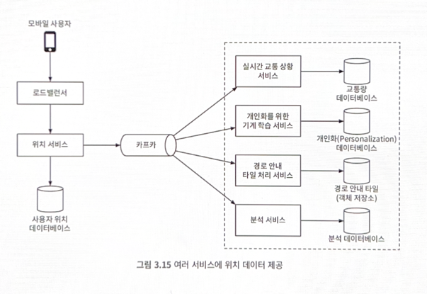
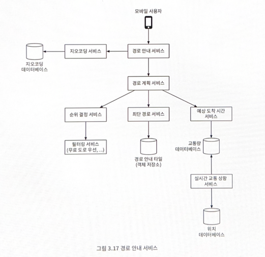
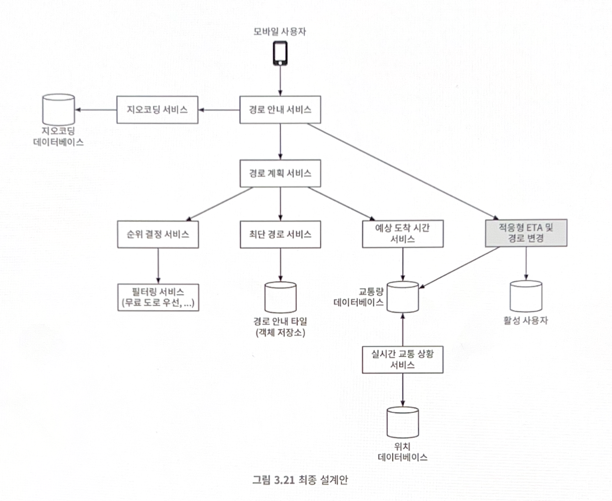

# 3장 구글 맵

구글 맵은 사용자가 목적지와 경로를 찾을 수 있도록 돕는다.

## 기능 요구사항
지원할 주 단말은 모바일 전화기, 즉 스마트폰이다.
- 사용자 위치 갱신
- 경로 안내 서비스 (ETA 서비스 포함)
- 지도 표시

## 비기능 요구사항
- 정확도
- 부드러운 경로 표시
- 데이터 및 배터리 사용량

## 지도 101
### 측위 시스템
구 표면 상의 위치를 표현하는 체계를 말한다. 위경도 기반 측위 시스템의 경우, 최상단에는 북극이 있고, 최하단에는 남극이 있다.

### 3차원 위치의 2차원 변화
3차원 구 위의 위치를 2차원 평면에 대응시키는 절차를 '지도 투영법' 또는 '도법'이라 부른다.

### 지오코딩
지오코딩은 주소를 지리적 측위 시스템의 좌표로 변환하는 프로세스다. 
가령 미국 내 주소 '1600 Amphitheatre Parkway, Mountain View, CA'의 지오코딩 결과는 (위도 37.423032, 경도 -122.0883739)이다.

### 지오해싱
지오해싱은 지도 위 특정 영역을 영문자와 숫자로 구성된 짧은 문자열에 대응시키는 인코딩 체계다.
지오해싱은 용도가 다양하다. 본 설계안은 맵 타일 관리에 지오해싱을 적용한다.

### 지도 표시
지도를 화면에 표시하는 방법은 상세히 다루지 않고, 기본적인 내용만 살펴본다.
지도를 화면에 표시하는데 가장 기본이되는 개념은 타일이다. 지도 전부를 하나의 이미지로 표시하는 대신, 작은 타일로 쪼개어 표시하는 것이다.

지도의 확대/축소를 지원하려면 확대 수준에 따라 다른 종류의 타일을 준비해야 한다.

### 계층적 경로 안내 타일
보통 구체성 정도를 상, 중, 하로 구분하여 세 가지 종류의 경로 안내 타일을 준비한다. 

가장 구체성이 높은 타일의 경우 (상) 그 크기는 아주 작으며, 이런 타일에는 지방도(local roads) 데이터만 둔다.
그 다음 레벨의 타일(중)은 더 넓은 지역을 커버하며, 규모가 비교적 큰 관할구(district)를 잇는 간선 도로 데이터만 둔다.
마지막으로 구체성이 가장 낮은 타일(하)은 그 보다 더 큰 영역을 커버하며, 그런 타일에는 도시와 주를 연결하는 주요 고속도로 데이터=-만 둔다.

## 개략적 설계안

### 위치 서비스
위치 서비스는 사용자의 위치를 기록하는 역할을 담당한다. 클라이언트가 t초마다 자기 위치를 전송한다고 가정한다.
사용자 위치가 바뀔 때마다 그 즉시 전송할 필요는 없다. 클라이언트에 버퍼링해 두었다가 일괄 요청하면 전송 빈도를 줄일 수 있다.

- 실시간 교통 상황을 모니터링라는 용도로 활용
- 새로 만들어진 도로나 폐쇄된 도로 탐지
- 사용자 행동 양태 분석하여 개인화된 경험 제공
- ETA를 좀 더 정확하게 산출

> (아주) 높은 쓰기 요청 빈도에 최적화되어 있고 규모 확장이 용이한 카산드라같은 데이터베이스가 필요

### 경로 안내 서비스
이 컴포넌트는 A에서 B 지점으로 가는 합리적으로 빠른 경로를 찾아주는 역할을 담당한다.

### 지도 표시
클라이언트의 위치 및 현재 클라이언트가 보는 확대 수준에 따라 필요한 타일을 서버에서 가져오는 접근법이 바람직하다.

- 사용자가 지도를 확대 또는 이동시키며 주변을 탐색할 때
- 경로 안내가 진행되는 동안 사용자의 위치가 현재 지도 타일을 벗어나 인접한 타일로 이동할 때

> 확대 수준별로 미리 만들어 둔 지도 타일을 클라이언트에 전달하는 방법이 효과적이다. 이때 CDN을 통해 캐시된 사본 데이터를 반환할 경우 응답 지연을 낮추고, 부하를 줄일 수 있다.

## 상세 설계

### 사용자 위치 데이터는 어떻게 이용되는가

위치를 데이터베이스에 기록하는 것과 별도로 카프카와 같은 메시지 큐에 로깅한다.

카프카는 응답 지연이 낮고 많은 데이터를 동시에 처리할 수 있는 데이터 스트리밍 플랫폼으로, 실시간 데이터 피드를 지원하기 위해 고안되었다.

개별 서비스틑 카르카를 통해 전달되는 사용자 위치 데이터 스트림을 각자 용도에 맞게 활용할 수 있다.

#### 지오코딩 서비스
주소를 위도와 경도 쌍으로 바꿔주는 서비스이다. 
경로 안내 서비스는 이 서비스를 호출하여 출발지와 목적지 주소를 위도/경도 쌍으로 변환한 뒤 추후 다른 서비스 호출에 이용한다.

#### 경로 계획 서비스
경로 계획 서비스는 현재 교통 상황과 도로 상태에 입각하여 이동 시간 측면에서 최적화된 경로를 제안하는 역할을 담당한다.
뒤이어 설명할 다른 서비스들과 통신하여 결과를 만들어 낸다.

#### 최단 경로 서비스
출발지와 목적지 위도/경도를 입력으로 받아 k개 최단 경로를 반환하는 서비스다. 이때 교통이나 도로 상황은 고려하지 않는다.
도로망 그래프는 거의 정적이므로 캐시해두면 좋다.

#### 예상 도착 시간 서비스
경로 계획 서비스는 최단 경로 목록을 수신하면 예상 도착 시간 서비스를 호출아려 그 경로 각가에 대한 소요 시간 추정치를 구한다.

예상 도착 시간 서비스는 기계 학습을 활용해 현재 교통 상황 및 과거 이력에 근거하여 예상 도착 시간을 계산한다. 
이때 까다로운 문제는 실시간 교통 상황 데이터만 필요한 게 아니라 앞으로 10분에서 20분 뒤에 교통 상황이 어떻게 달라질지도 예측해야 한다는 것이다.

#### 적응형 ETA와 경로 변경
현 설계안은 적응형 ETA와 경로 변경을 허용하지 않는다. 아래는 이를 반영한 최종 설계안이다.

