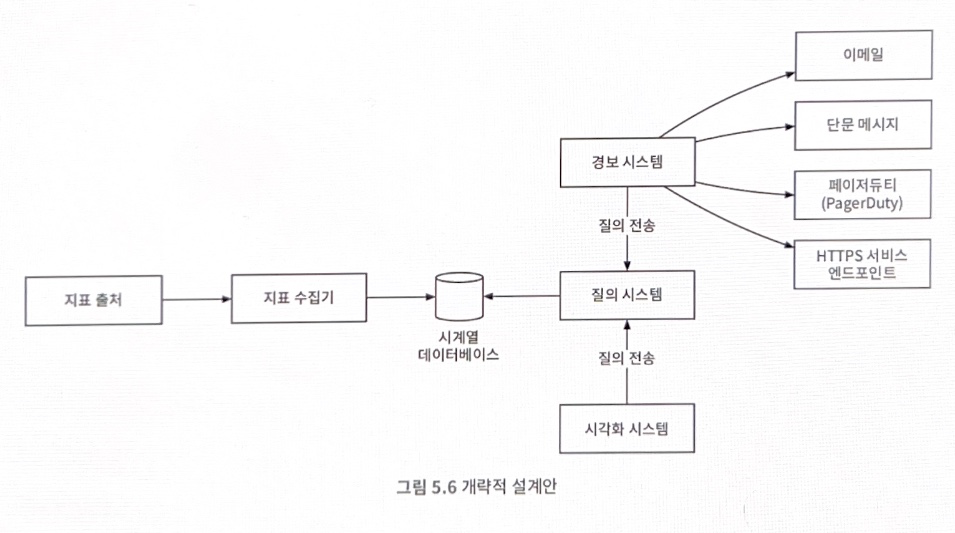

# 5장 지표 모니터링 및 경보 시스템

이번 장에서는 규모 확장이 용이한 지표 모니터링 및 경보 시스템의 설계안을 살펴보겠다. 
잘 설계된 지표 모니터링 및 경보 시스템은 인프라의 상태를 선명하게 볼 수 있도록 하여 높은 가용성과 안정성을 달성하는 데 중추적 역할을 한다.

### 개략적 요구사항 및 가정
- 대규모 인프라 모니터링
- 모니터링 지표
  - CPU 사용률
  - 요청 수
  - 메모리 사용량
  - 메시지 큐 내의 메시지 수

### 고려하지 않아도 되는 요구사항
- 로그 모니터링
- 분산 시스템 추적

## 개략적 설계안

- **지표 출처**: 지표 데이터가 만들어지는 곳으로 애플리케이션 서버, SQL 데이터베이스, 메시지 큐 등 어떤 것이든 가능
- **지표 수집기**: 지표 데이터를 수집하고 시계열 데이터에 기록하는 역할
- **시계열 데이터베이스**: 지표 데이터를 시계열 형태로 보관하는 저장소
- **질의 서비스**: 질의 서비스는 시계열 데이터베이스에 보관된 데이터를 질의하고 가져오는 과정을 돕는 서비스
- **경보 시스템**: 경보를 받아야 하는 다양한 대상으로 경보 알림을 전송하는 역할을 하는 시스템 (to 이메일, 단문 메시지, 페이저듀티, HTTPS 서비스 엔드 포인트)
- **시각화 시스템**: 지표를 다양한 형태의 그래프/차트로 시각화 하는 기능을 제공하는 시스템

## 상세 설계

### 지표 수집
카운터나 CPU 사용량 같은 지표를 수집할 때는 때로 데이터가 소실되어도 아주 심각한 문제는 아니다. 
지표를 보내는 클라이언트는 성공적으로 데이터가 전송되었는지 신경 쓰지 않아도 상관없다.

지표 데이터 수집 방법에는 두 가지 모델이 있다.

- 풀 모델: 실행 중인 애플리케이션에서 주기적으로 지표 데이터를 **가져오는** 지표 수집기가 이 흐름의 중심이 된다.
- 푸시 모델: 푸시 모델은 지표 풀퍼에 해당하는 서버, 즉 웹 서버나 데이터베이스 서버같은 서버가 직접 지표를 수집기에 **전송하는** 모델이다.

### 지표 전송 파이프라인의 규모 확장
지표 수집기는 서버 클러스터 형태이며 엄청난 양의 데이터를 받아 처리해야 한다. 
하지만 시계열 데이터베이스에 장애가 생기면 데이터 손실이 발생할 가능성이 있다. 큐를 두면 이런 문제를 해결할 수 있다. -> 카프카

### 저장소 계층
저장 용량 최적화
- 데이터 인코딩 및 압축
- 다운 샘플링: 데이터의 해상도를 낮춰 저장소 요구량을 줄이는 기법
- 냉동 저장소: 잘 사용되지 않는 비활성 상태 데이터를 보관하는 곳

### 경보 시스템
1. 설정 파일을 가져와 캐시 서버에 보관
2. 경보 관리자는 경보 설정 내역을 캐시에서 가져옴
3. 설정된 규칙에 근거하여 경보 관리자는 지정된 시간마다 질의 서비스를 호출
4. 경보 저장소는 카산드라 같은 형태의 키-값 저장소다. 모든 경보의 상태(비활성화, 응답 대기, 경보 발령, 문제 해결 등)가 여기 보관된다. 알림이 적어도 한 번 이상 전달되도록 보장하는 구실을 함
5. 경보 이벤트를 카프카에 전달
6. 경보 소비자는 카프카에서 정보 이벤트를 읽음
7. 경보 소비자는 카프카에서 읽은 경보 이벤트를 처리하여 이메일, 단문 메시지, 페이저듀티, HTTP 서비스 엔드포인트 등의 다양한 채널로 알림을 전송

경보 시스템 만들 것인가 VS 구매할 것인가 

### 시각화 시스템
시각화 시스템은 데이터 계층 위에 만들어진다. 지표 대시보드에는 지표를 다양한 시간 범위로 표시하고, 경보 대시보드에는 다양한 경보의 상태를 표시한다. (요청 수, 메모리/CPU 사용률, 페이지 로드 시간, 트래픽 양, 로그인 현황 등..)