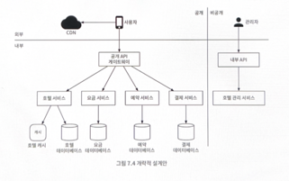

# 7장 호텔 예약 시스템

### 비기능 요구사항
- 높은 수준의 동시성(concurrency)
- 적절한 지연 시간

### 개략적 규모 추정
- 객실 정보 확인 페이지의 QPS는 300
- 예약 페이지의 QPS는 30 
- 최종 예약 TPS는 3

### 데이터 모델
- 대략적인 추정 과정을 통해 시스템 규모가 크지 않은 것을 알 수 있음
- 하지만, 대규모 이벤트가 있는 경우에는 트래픽이 급증 할 수 있으니 대비해야 함
- 관계형 데이터베이스는 읽기 빈도가 쓰기 연산에 비해 높은 작업을 잘 지원함
- NoSQL 데이터베이스는 대체로 쓰기 연산에 최적화
- 관계형 데이터베이스는 ACID 속성 (원자성, 일관성, 격리성, 영속성)을 보장
- 관계형 데이터베이스를 사용하면 엔티티간의 관계를 안정적으로 설계 가능

### 개략적 설계안

## 상세 설계

### 동시성 문제
이중 예약을 어떻게 방지할 것인지 두 가지 문제를 해결해야 한다.
1. 같은 사용자가 예약 버튼을 여러 번 누를 수 있다.
2. 여러 사용자가 같은 객실을 동시에 예약하려 할 수 있다.

#### [ 1번째 시나리오 ]
- 클라이언트 측 구현: 클라이언트가 요청을 전송하고 난 다음에 '예약' 버튼을 비활성화한다.(예 - 디바운싱, 쓰로틀링) 이렇게하면 대부분의 이중 클릭 문제는 해결할 수 있지만 그다지 안정적인 방법은 아니다.
- 멱등 API: 예약 API 요청에 멱등 키를 추가하는 방안이다. 몇 번을 호출해도 같은 결과를 내는 API를 멱등 API라고 부른다.

**멱등 API 요청 플로우** 
1. 고객이 예약 세부 정보를 입력하고 '계속' 버튼을 누르면 예약 서비스는 예약 주문을 생성
2. 고객이 검토할 수 있도록 예약 주문서를 반환한다. 이때 API는 반환 결과에 reservation_id를 넣는다. 이 식별자는 전역적 유일성을 보증해야 한다.
3. 검토가 끝난 예약을 전송한다. 이때 요청에도 reservation_id를 함께 전송한다.
4. 사용자가 예약 완료 버튼을 한 번 더 누르는 바람에 같은 예약이 다시 서버로 전송되더라도 reservation_id 를 이용해 멱등성을 보장할 수 있다.

> 클라이언트 -> 서버 -> 외부 서버
> 
> 위 같은 단계일 경우 멱등키를 어디서 만드는 게 좋을까? 

#### [ 2번째 시나리오 ]
동시성 문제에 대한 내용이다. 이 문제를 해결하려면 어떤 형태로든 락(Lock)을 활용해야 한다.
- 비관적 락
- 낙관적 락
- 데이터베이스 제약 조건

**방안 1: 비관적 락**
- 해당 레코드를 갱신하려는 다른 사용자는 먼저 락을 건 사용자가 변경을 마치고 락을 해제할 때까지 대기
- MySQL의 경우 `SELECT ... FOR UPDATE` 를 제공
- 장점
  - 애플리케이션이 아니라 데이터베이스 락을 사용하는 것이기 때문에 쉬운 구현
  - 모든 갱신 연산을 직렬화하여 충돌을 막기 때문에 데이터에 대한 경합이 심할 때 유용
- 단점
  - 교착 상태(deadlock) 발생 가능성으로 인해서 애플리케이션 코드 작성이 까다로울 수 있음
  - 확장성이 낮음. 트랜잭션의 수명이 길면 데이터베이스 성능에 심각한 영향을 끼침
- **위 같은 이유로 예약 시스템에 비관적 락 메커니즘을 사용하는 것은 권장 X**

**방안 2: 낙관적 락**
- 비관적 락과 달리 여러 사용자가 동시에 같은 자원을 갱신라여 시도하는 것을 허용
- 버전이나 타임스탬프 등을 통해서 레코드의 버전을 관리해서 동시성 문제를 해결
- 장점
  - 데이터베이스 자원에 락을 걸 필요없음. 버전 번호를 통해 해플리케이션에서 구현
  - 낙관적 락은 데이터에 대한 경쟁이 치열하지 않은 상황에 적합하기 때문에 락을 관리하는 비용 없이 트랜잭션을 수행할 수 있음
- 단점
  - 데이터에 대한 경쟁이 치열한 상황에서는 성능이 좋지 못함
- **낙관적 락은 호텔 예약 시스템에 적합한 선택지**

**방안 3: 데이터베이스 제약 조건**
- 이 접근법은 낙관적 락과 아주 유사
- 장점
  - 구현이 쉬움
  - 데이터에 대한 경쟁이 심하지 않을 때 잘 동작
- 단점
  - 낙관적 락과 마찬가지로 데이터에 대한 경쟁이 심하면 실채하는 연산 수가 늘어남
  - 데이터베이스 제약 조건은 애플리케이션 코드와 달리 버전 통제의 어려움
  - 제약 조건을 허용하지 않는 데이터베이스도 있기 때문에 특정 데이터베이스에 대한 의존성이 생김
- **이 접근법은 구현이 쉽고 호텔 예약의 경우에는 데이터에 대한 경쟁이 심하지 않으므로 좋은 선택지**

### 시스템 규모 확장
- 데이터베이스 샤딩
- 캐시 -> 부하를 분산시키기 위한 목적이 크다고 생각함
- 서비스 간 데이터 일관성

#### 서비스 간 데이터 일관성
데이터 일관성 문제를 해결하기 위해 분산 트랜잭션이 필요
- 2단계 커밋(2-phase commit)
  - 2PC는 여러 노드에 걸친 원자적 트랜잭션 실행을 보증하는 데이터베이스 프로토콜
  - 즉, 모든 노드가 겅공 또는 실패 둘 중 하나로 트랜잭션이 마무리되도록 보증
  - 모든 노드의 커밋 가능 여부를 기다려야 되기 때문에 성능이 뛰어난 프로토콜은 아님. 즉, 확장성과 속도면에서 아쉬움
- 사가(Saga)
  - 사가는 각 노드에 국지적으로 발생하는 트랜잭션을 하나로 엮은 것
  - 각각의 트랜잭션은 완료되면 다음 트랜잭션을 시작하는 트리거로 쓰일 메시지를 만들어보냄
  - 어느 한 트랜잭션이라도 실패하면 사가는 이 전의 트랜잭션의 결과를 전부 되돌리는 트랜잭션들을 순차적으로 실행
  - 즉, 보상 트랜잭션을 직접 구현해야함