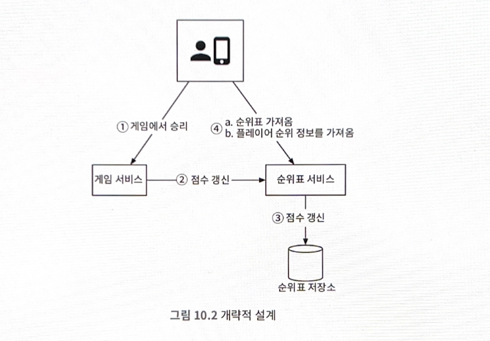

# 10장 실시간 게임 순위표

### 기능 요구사항
- 순위표에 상위 10명의 플레이어를 표시
- 특정 사용자의 순위를 표시
- 어떤 사용자보다 4순위 위와 아래에 있는 사용자를 표시 (보너스 문제)

### 비기능 요구사항
- 점수 업데이트는 실시간으로 순위표에 반영
- 일반적인 확장성, 가용성 및 안정성 요구사항

### 개략적 규모 추정
- 500만 DAU
- 초당 평균 50명의 사용자 -> 피크 타임의 경우 평균 5배 즉, 초당 최대 250명
- 한 사용자는 하루 평균 10게임을 플레이
- 사용자 점수 획득 평균 QPS: 50 * 10 =~ 500 (최대는 평균의 5배 즉, 2500 QPS)
- 상위 10명 순위표 가져오기 QPS: 하루에 한 번 표시한다는 조건을 전제하에 50

## 개략적 설계안

### 데이터 모델

**관계형 데이터베이스**
데이터가 많지 않을 때는 효과적이지만, 레코드가 수백만 개 정도로 많아지면 성능이 너무 나빠지는 문제가 있다.
- 사용자의 순위를 파악하려면 모든 플레이어를 정렬해야 함
- 같은 점수를 받은 사용자가 중복으로 존재할 수 있고, 여기에 대해서 세밀한 제어가 힘듦
- SQL 데이터베이스는 지속적으로 변호화하는 대량의 정보를 신속하게 처리하지 못함 (오래거림)

**레디스**
복잡한 DB 쿼리 없이도 일반적인 순위표 작업을 쉽게 수행할 수 있음
- 레디스는 메모리에서 동작하므로 빠른 읽기 및 쓰기가 가능
- 순위표 시스템 설계 문제를 해결하는 데 이상적인 **정렬 집합(sorted set)**을 제공
- 일반적인 정렬된 단방향 연결 리스트는 삽입, 검색 연산 비용이 O(n) 이지만, sorted set은 O(log (n)) 이므로 관계형 DB보다 성능이 좋다.
- 정렬 집합으로 구현할 때 참고할 수 있는 명령어: ZADD, ZINCRBY, ZRANGE / ZREVRANGE, ZRANK / ZREVRANK
- 개략적 규모 추정을 통한 결과를 토대로 레디스 노드 1대로 구현 가능
- 레디스 사본을 두는 식으로 구성하면 장애 회복도 방어가 됨

## 상세 설계

### 레디스 규모 확장
고정 파티션 VS 해시 파티션

**고정 파티션**
- 순위표에 등장하는 점수의 범위에 따라 파티션을 나누는 방안
- 순위표 점수가 고르게 분포되어야 함
- 사용자의 점수가 갱신됨에 따라서 다른 샤드로 옮겨줘야 하는 번거로움
- 점수를 기준으로 샤딩되어 있기 때문에 순위별로 데이터를 조회할 때 큰 이점

**해시 파티션**
- 레디스 클러스터를 사용하는 것으로, 사용자들의 점수가 특정 대역에 과도하게 모여있는 경우 효과적
- 여러 노드에 데이터를 자동으로 샤딩하는 방법을 제공
- 각가의 키가 특정한 해시 슬롯에 속하도록 하는 샤딩 기법
- 점수와 관련없이 사용자 정보가 각 샤딩에 저장되어 있기 때문에 순위에 따른 데이터 조회 시 모든 샤드 탐색 필수

