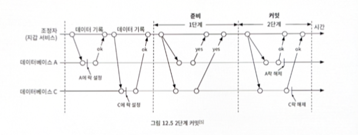
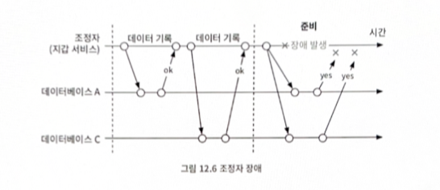
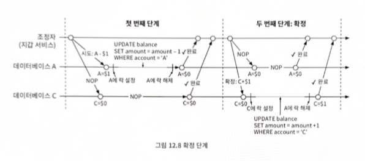
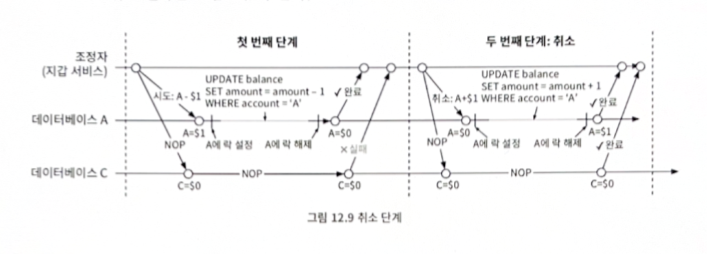
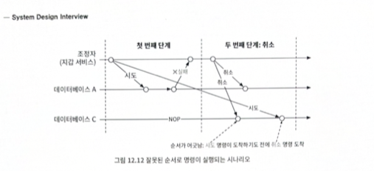
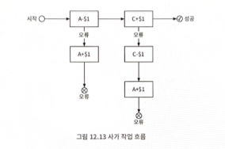
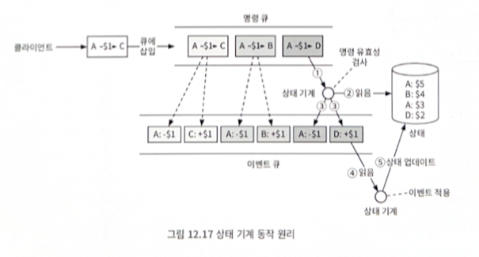

# 전자 지갑

#### 요구사항
- 전자 지갑 간 이체
- 1,000,000 TPS
- 99.99%의 안정성
- 트랜잭션
- 재현성

## 분산 트랜잭션

### 1. 분산 트랜잭션: 2단계 커밋 (2PC)
- 데이터베이스 자체에 의존하는 저수준 방안
- 조정자는 정상적으로 여러 데이터베이스에 읽기 및 쓰기 작업을 수행

### 2. 분산 트랜잭션: TC/C (Try-Confirm/Cancel)
- 두 단계로 구성된 보상 트랜잭션
- 2PC의 두 단계는 한 트랜잭션이지만 TC/C에서는 각 단계가 별도 트랜잭션
- 첫 번째 단계: 시도 - 시도 단계에서는 조정자 역할을 하는 지갑 서비스가 두 개의 트랜잭션 명령을 두 데이터베이스로 전송
- 두 번째 단계: 확정 - 두 데이터베이스가 모두 예라고 응답하면 지갑 서비스는 확정 단계 시작
- 두 번째 단계: 실패 - 첫 번째 시도 단계가 실패할 경우 지갑 서비스는 취소 단계 시작

#### 잘못된 순서로 실행된 경우

TC/C에는 실행 순서가 어긋날 수 있다는 문제가 있다.
- 취소 명령이 먼저 도착하면 데이터베이스에 아직 상응하는 시도 명령을 못보았음을 나타내는 플래그를 참으로 설정하여 저장
- 시도 명령이 도착하면 항상 먼저 도착한 취소 명령이 있었는지 확인하여, 있었으면 바로 실패 반환

### 3. 분산 트랜잭션: 사가(Saga)
- 사가(Saga)는 유명한 분산 트랜잭션 솔루션 가운데 하나로 MSA 아키텍처에서는 사실상 표준
- TC/C 와는 다르게 병렬 실행 가능성이 X

- 분산 조율: 마이크로서비스 아키텍처에서 사가 분산 트랜잭션에 관련된 모든 서비스가 다른 서비스의 이벤트를 구독하여 작업을 수행하는 방식. 완전히 탈 중앙화된 조율 방식.
- 중앙 집중형 조율: 아나의 조정자가 모든 서비스가 올바른 순서로 작업을 실행하도록 조율

## 이벤트 소싱
데이터 저장 방식 중 하나로 발생한 이벤트를 저장하는 기법 (for 재현성)

아래같은 질문들에 대한 해결책 중 하나
1. 특정 시점의 계정 잔액을 알 수 있나?
2. 과거 및 현재 계정 잔액이 정확한지 어떻게 알 수 있나?
3. 코드 변경 후에도 시스템 로직이 올바른지는 어떻게 검증하나?

#### 정의

1. 명령: 외부에서 전달된, 의도가 명확한 요청 (순서는 아주 중요)
2. 이벤트: 명령 이행 결과
3. 상태: 이벤트가 적용될 때 변경되는 내용
4. 상태 기계: 이벤트 소싱 프로세스를 구동
   - 명령의 유효성을 검샇하고 이벤트 생성
   - 이벤트를 적용하여 상태 갱신

