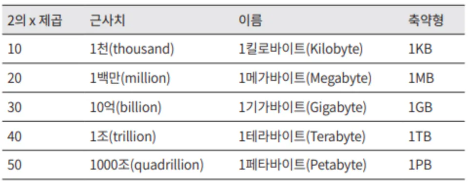
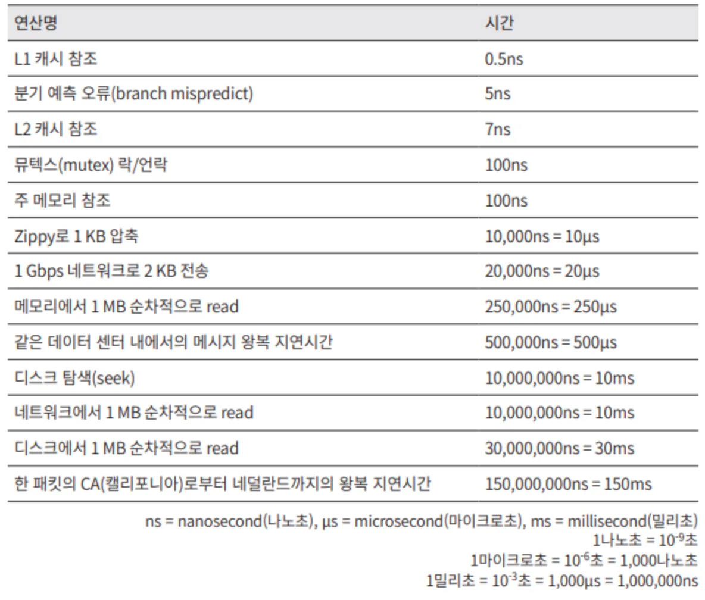
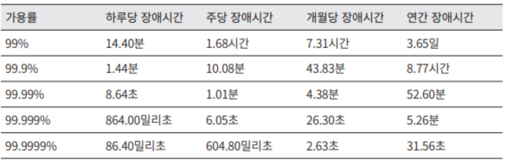

# 개략적인 규모 추정

시스템 용량이나 성능 요구사항을 개략적으로 추정할 수 있는 방법

- 개략적인 규모 추정: “개략적인 규모 추정은 보편적으로 통용되는 성능 수치상에서 사고 실험을 행하여 추정치를 계산하는 행위로서, 어떤 설계가 요구사항에 부합할 것인지 보디 위한 것”이다.
- 규모 확장성을 표현하는 데 필요한 기본기에 능숙해야 한다. 특히, 2의 제곱수나 응답지연 값, 그리고 가용성에 관계된 수치들을 기본적으로 잘 이해하고 있어야 한다.

# 2의 제곱수

제대로 된 계산 결과를 얻으려면 데이터 볼륨의 단위를 2의 제곱수로 표현하면 어떻게 되는지를 우선 알아야 한다. (최소 단위는 1바이트이고, 8비트로 구성된다.)

[ 흔히 쓰이는 데이터 볼륨 단위들 ]

> 2의 제곱수와 개략적인 규모 추정과 어떤 직접적인 연관이 있을지 고민해봤지만 솔직히 이 부분은 잘 모르겠다. 2의 제곱수로 계산을 하는 이유는 정확성 때문일까?

# 응답지연 값

구글의 제프 딘이 2010년에 공개한 통상적인 컴퓨터에서 구현된 연산들의 응답지연 값들. (이들 가운데 몇몇은 더 빠른 컴퓨터가 등장하면서 더 이상 유효하지 않게 되었지만, 처리 속도가 어느 정도인지 짐작할 수 있도록 도와줌)

- 메모리는 빠르지만 디스크는 여전히 느리다.
- 디스크 탐색(seek)은 가능한 한 피하라.
- 단순한 압축 알고리즘은 빠르다.
- 데이터를 인터넷으로 전송하기 전에 다능하면 압축하라.
- 데이터 센터는 보통 여러 지역에 분산되어 있고, 센터들 간에 데이터를 주고받는 데는 시간이 걸린다.

# 가용성에 관계된 수치들

고가용성은 시스템이 오랜 시간 동안 지속적으로 중단 없이 운영될 수 있는 능력을 지칭하는 용어다.

SLA(Service Level Agreement)는 서비스 사업자가 보편적으로 사용하는 용어로, 서비스 사업자가 제공하는 서비스의 가용시간(uptime)이 공식적으로 기술되어 있다.

# 예제: 트위터 QPS와 저장소 요구량 추정

아래는 위에서 배웠던 내용으로 트위터의 QPS와 저장소 요구량을 추정해보는 내용으로, 아래 제시된 수치들은 연습용이며 트위터의 실제 성능이나 요구사항과는 아무 관계가 없다.

### 가정

- 월간 능동 사용자(MAU)는 3억명이다.
- 50%의 사용자가 트위터를 매일 사용한다.
- 평균적으로 각 사용자는 매일 2건의 트윗을 올린다.
- 미디어를 포함하는 트윗은 10% 정도다.
- 데이터는 5년간 보관된다.

### 추정

QPS(Query Per Second)  추정치

- 일간 능동 사용자(DAU) = 3억 x 50% = 1.5억
- QPS = 1.5억 x 2 트윗 / 24시간 / 3600초 = 약 3500
- 최대 QPS(Peek QPS) = 2 x QPS = 약 7000

미디어 저장을 위한 저장소 요구량

- 평균 트윗 크기
  - tweet_id → 64바이트
  - 텍스트 → 140바이트
  - 미디어 → 1MB
- 미디어 저장소 요구량: 1.5억 x 2 x 10% x 1MB = 30TB/일
- 5년간 미디어를 보관하기 위한 저장소 요구량: 30TB x 365 x 5 = 약 55PB